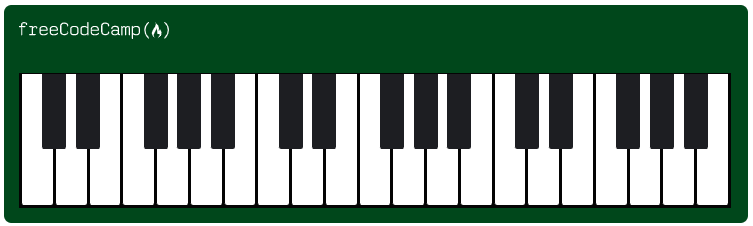

# Piano - FreeCodeCamp

🔗 [Click here to access](https://carvmi.github.io/responsivewebdesign/)
## Technologies 
- HTML
- CSS

## What I have learned
- The float property specifies whether an element should float to the left, right, or not at all;
- The position of #piano selector was set to relative because the img element needs its parent to have a position set as a point of reference.
- Media queries are commonly used to apply CSS based on the viewport width using the max-width and min-width properties;
- Setting overflow property to hidden in the first .keys selector avoids keys' collapse when the browser window is smaller than the max-width (768px);

## Contact
milenadecarvalho2000@gmail.com
